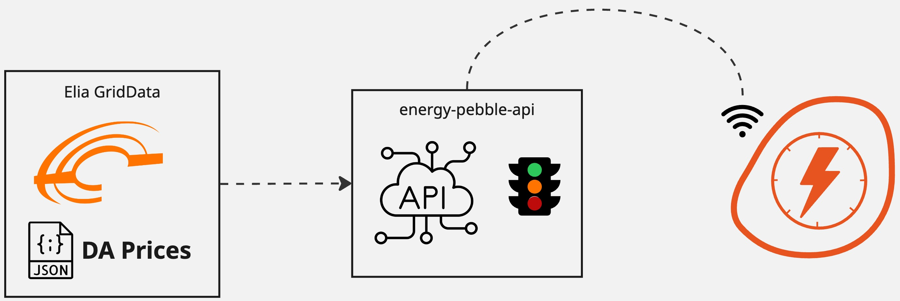

# Energy Pebble ESPHome

A simple LED ring that shows when electricity is cheap or expensive. 
Because who doesn't want their energy prices served with a side of pretty lights?

## What it does

Shows hourly electricity prices using colors:
- **Green**: Cheap energy (go wild with the washing machine!)
- **Yellow**: Medium prices (maybe hold off on that extra load)
- **Red**: Expensive (time to go read a book)

The outer ring shows the next 8 hours, center LED shows right now.

## Hardware

- ESP32 Lolin Mini C3
- 24-LED ring matrix 
- Single center LED
- 3D-printed white housing
- USB cable for power

## API

Fetches data from: `https://energypebble.tdlx.nl/api/color-code`
Returns hourly color codes (G/Y/R) for the current and next 11 hours.

## ESPHome

Uses ESPHome for:
- WiFi connectivity
- LED control
- API calls every hour
- Home Assistant integration (if you're into that)

## Setup

1. Flash ESPHome config to ESP32
2. Add WiFi credentials  
3. Stick it on the wall
4. Watch the pretty lights and save money

That's it! Now you can optimize your dishwasher schedule like a pro.

