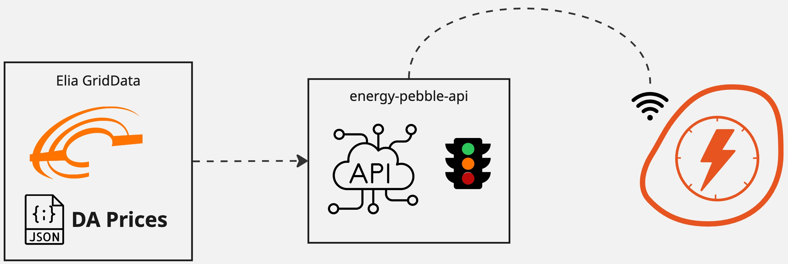

# Energy Pebble

A small device that glows **green** when electricity is cheap, **amber** when it
is average and **red** when it is expensive. No app to open, no price graph to
read: the answer is a colour you can see from across the room.

This repository is the device: ESPHome firmware, the LED behaviour, and the
companion page people use to get it onto their Wi-Fi.

## What it shows

The outer ring is the next 8 hours, one segment each. The centre LED is the
hour you are in.

Colours come from Belgian day-ahead prices, and they are **committed for 8
hours**: once a colour appears it will not change under you, so you can plan
around it. The signal is also personalised, so a household with a fixed-price
contract, solar panels or a home battery sees a different pattern from its
neighbour on a dynamic tariff.

## Hardware

- ESP32-S3-Zero
- 24-LED ring
- single centre LED
- 3D-printed housing
- USB cable for power

## Getting one connected

Plug it in. When the centre LED pulses blue slowly it is waiting for Wi-Fi, and
[energypebble.tdlx.nl/setup](https://energypebble.tdlx.nl/setup/) walks through
it: one tap over Bluetooth on Chrome and Edge, or the setup network on
everything else. `PROVISIONING.md` has the detail, including what each LED
state means.

The `setup/` directory here holds the standalone version of that page, kept
free of external requests so it can be dropped on any static host.

## Firmware updates

Signed, and verified on the device before anything is written. See
`DEVICE_SIGNING.md`.

## The rest of the product

- **[energy-pebble-api](https://github.com/thomaskgb/energy-pebble-api)** is the
  service: the API this device polls, the website people configure it on, and
  the admin console.
- **[energy-pebble-homeassistant](https://github.com/thomaskgb/energy-pebble-homeassistant)**
  exposes your pebble's colour as a Home Assistant sensor, installable through
  HACS as a custom repository.
